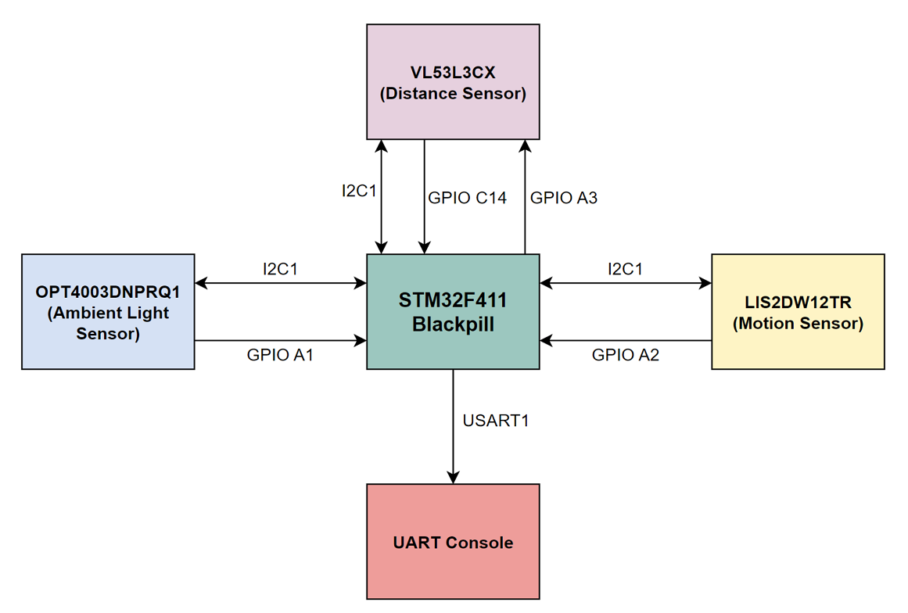

# Door Monitoring System

## User Requirements

Create firmware to sense door status using a combination of accelerometer, ToF sensor, and light sensor. The ToF shall be turned off by default due to power constraints and only turned on when light sensor or accelerometer sense relevant changes.

## User Assumptions

- Light sensor is OPT4003DNPRQ1
- ToF sensor is VL53L3CX
- Accelerometer is LIS2DW12TR
- All sensors connected on the same I2C bus
- All sensors have their own interrupt pin connected to MCU

## Requirement for Door Monitoring Project

- Able to detect door status in OPENED state
- Able to detect door status in CLOSED state
- Able to show door status by printing it in console terminal
- Low power operation

## Designer/Implementer Assumptions

- There is no light source inside the room
- There is light source outside the room
- Ambient light sensor placed to detect light inside the room (door closed, no light = 0 lux. Door opened, minimal light = 5 lux)
- Distance sensor measure distance between door tip and it's frame (Closed: d < 1 cm, Open: d >= 1 cm)
- Door motion with acceleration 0.1 - 0.2 g is enough
- Stop mode is used for low power operation of the MCU
- Half opened door is regarded as door opened state
- Distance sensor has 5 seconds timeout when activated

## High level state machine to detect Door State

DOOR_CLOSED → [Accel/Light Trigger] → Activate ToF → Measure → Update State → DOOR_OPEN  
DOOR_OPEN → [Accel/Light Trigger] → Activate ToF → Measure → Update State → DOOR_CLOSED

## Technical Specification for Door Monitoring Project

- MCU: STM32F411CE (Blackpill board)
- Light sensor is OPT4003DNPRQ1
- Time of Flight sensor is VL53L3CX
- Accelerometer is LIS2DW12TR

## Hardware High Level Design

This is the layout of the physical part that make the system

  

### Connection Table

| Sensor | Pin | Function | Connected to STM32F411CE |
|--------|-----|----------|--------------|
| VL53L3CX | XSHUT | Digital input (Active low) | GPIO C14 |
| VL53L3CX | GPIO1 | Digital output (Interrupt, Open drain) | GPIO A3 |
| VL53L3CX | SDA | I2C Data | I2C1 |
| VL53L3CX | SCL | I2C Clock | I2C1 |
| LIS2DW12TR | SDA | I2C Data | I2C1 |
| LIS2DW12TR | SCL | I2C Clock | I2C1 |
| LIS2DW12TR | INT1 | Interrupt | GPIO A2 |
| OPT4003DNPRQ1 | SDA | I2C Data | I2C1 |
| OPT4003DNPRQ1 | SCL | I2C Clock | I2C1 |
| OPT4003DNPRQ1 | INT | Interrupt | GPIO A1 |

## Firmware Architecture

IMAGE

## Firmware Design

List of interfaces

